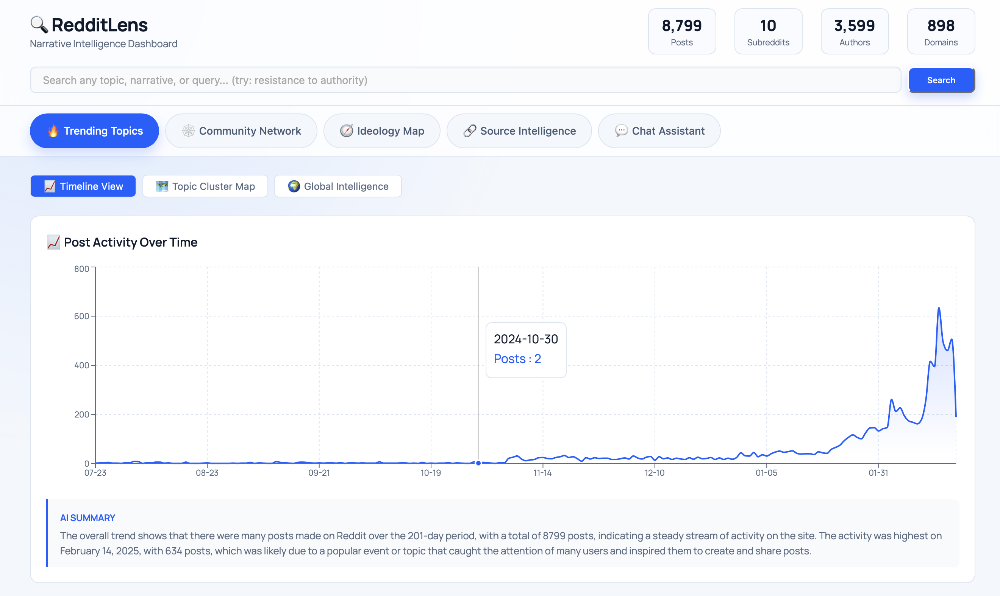
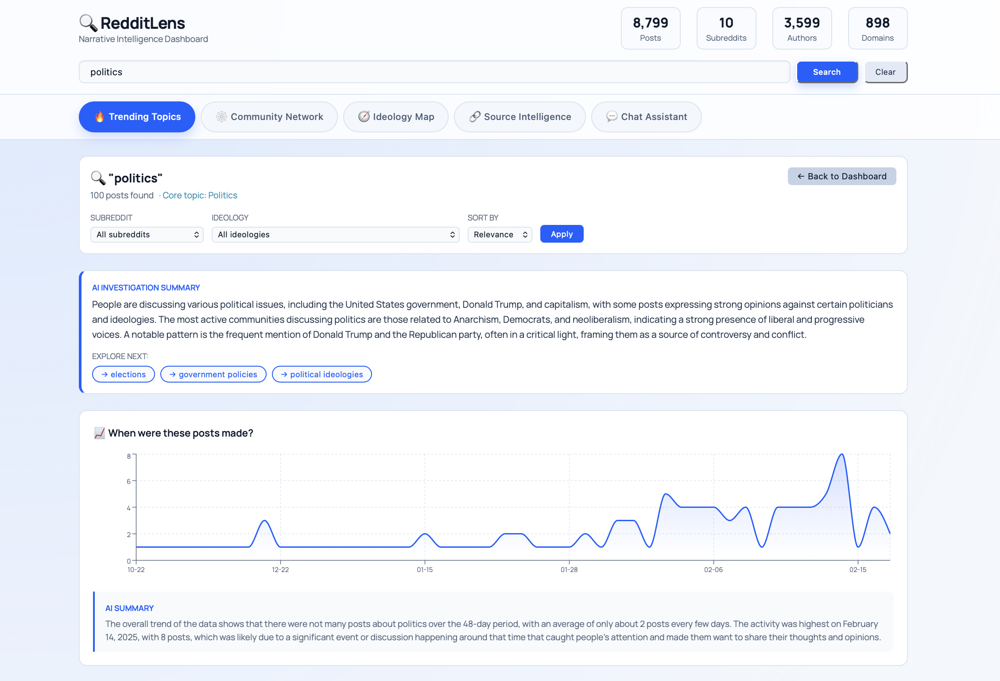
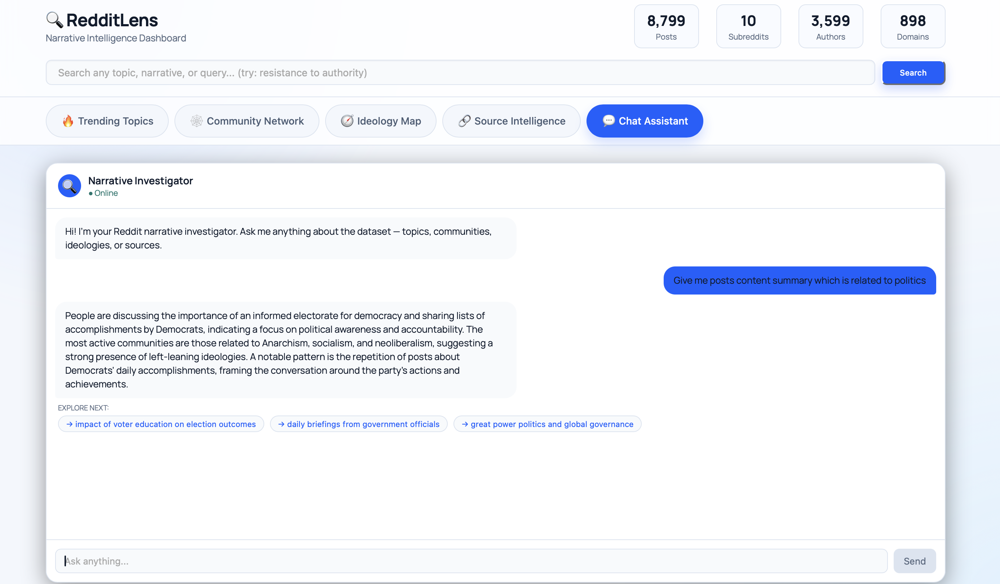
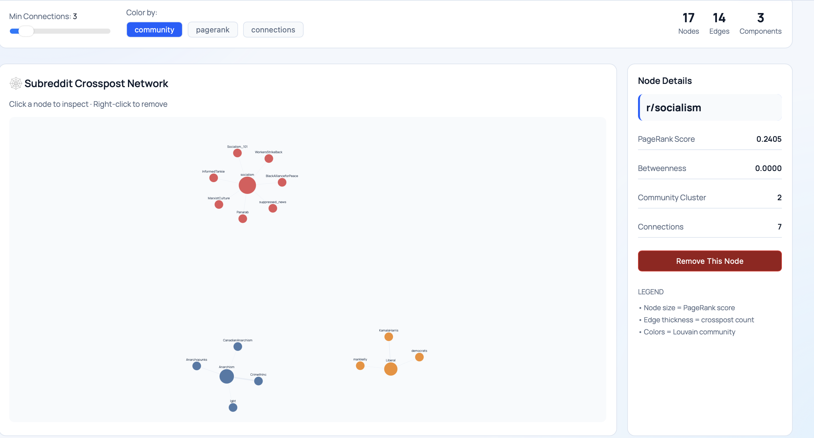
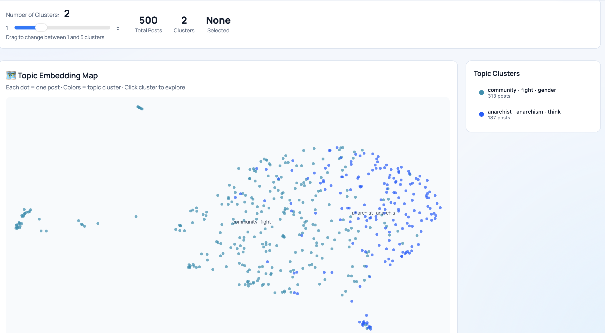
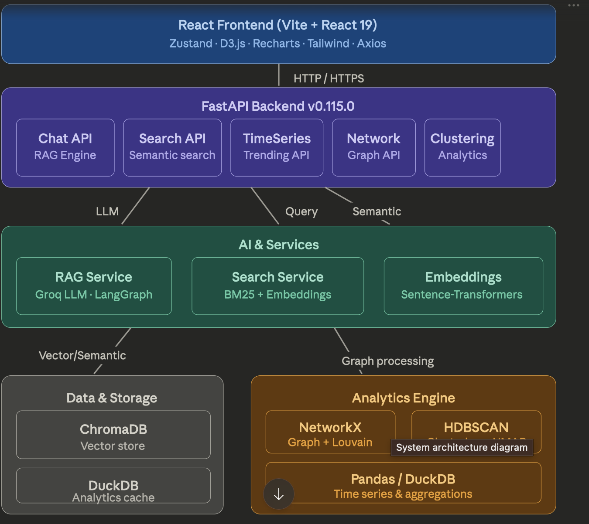
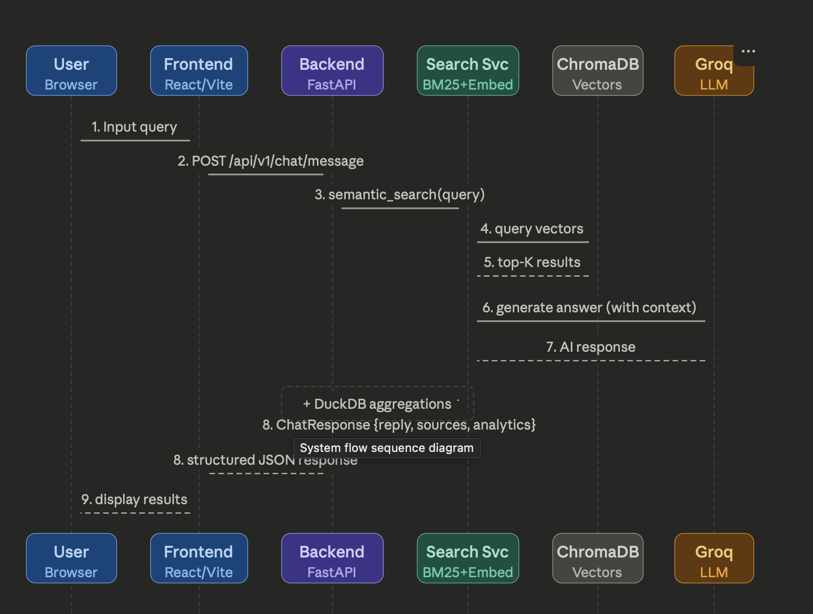
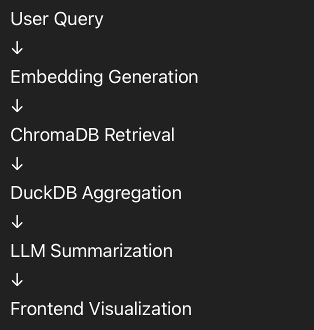
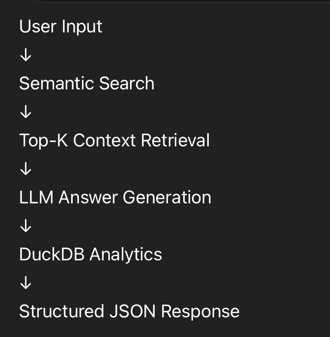

# Reddit Narrative Intelligence Dashboard

An AI-powered system to analyze, interpret, and visualize evolving narratives across Reddit using semantic search, clustering, network analysis, and global trend comparison.

---

## Video Demo
Video-Demo: https://drive.google.com/drive/folders/1QOYCdph1ERCP4vCwbtC6WLWElnkt98_I?usp=sharing

---

## Live Project Links

Project-Link:https://karmit-research-engineering-intern.vercel.app/
---

## Problem We Solve

Online narratives are fragmented across communities, ideologies, and sources. This project helps answer:

- What topics are trending and how they change over time
- Which communities influence one another
- Which ideologies dominate narrative clusters
- Which external sources are most shared
- How Reddit narratives compare to global trend signals

---

## Solution Approach

- Ingest and preprocess Reddit data
- Store analytics-ready records in DuckDB
- Generate vector embeddings and index in ChromaDB
- Run semantic retrieval and agentic synthesis
- Expose analytics and AI endpoints using FastAPI
- Visualize insights in a React dashboard
- Deploy frontend on Vercel and backend on AWS EC2 with Docker

---
## Screenshots

### Dashboard


### User-Query


### Chat Assistant


### Network Graph


### Topic Clusters


---

## Core Components

### Frontend
- React (Vite + React 19)
- Zustand
- D3.js
- Recharts
- Axios
- Tailwind CSS

### Backend
- FastAPI + Uvicorn
- LangGraph + LangChain
- Groq LLM integration

### AI and Retrieval Layer
- Query understanding node
- Semantic retrieval (ChromaDB vectors)
- Data aggregation (DuckDB)
- AI synthesis and related queries

### Data and Analytics Layer
- ChromaDB (vector store)
- DuckDB (analytical store)
- NetworkX + Louvain (network intelligence)
- KMeans + UMAP (topic clustering)
- Pandas/DuckDB aggregations
- PyTrends (global trend signal)

---

## End-to-End User Flow

1. User opens dashboard and selects a feature tab.
2. Frontend calls backend API with filters/query.
3. Backend runs retrieval, aggregation, and AI nodes.
4. Response is returned as structured JSON.
5. Frontend renders charts, cards, graphs, and chat output.

---

## AI Pipelines

### Semantic Retrieval
- Sentence-Transformer embeddings
- Vector similarity search in ChromaDB
- Filter-aware retrieval by subreddit and ideology

### Agentic Pipeline (LangGraph)
- Query understanding
- Retrieval
- Aggregation
- Synthesis

### Topic Clustering
- Embedding normalization
- UMAP projection to 2D
- KMeans clustering
- Auto-labeling using frequent terms

### Network Intelligence
- Graph construction from interaction edges
- PageRank
- Betweenness centrality
- Louvain communities

### Global Intelligence
- PyTrends integration
- Cached fallback strategy
- Reddit versus global topic comparison
- Trend lag estimation

---

## Tech Stack

### Frontend
- React + Vite
- Zustand
- D3.js
- Recharts
- Axios
- Tailwind CSS

### Backend
- FastAPI
- Uvicorn
- LangGraph
- LangChain
- Groq API
- DuckDB
- ChromaDB

### ML and AI
- Sentence Transformers
- Scikit-learn
- UMAP
- KMeans
- NetworkX
- python-louvain

### DevOps
- Docker
- AWS EC2
- Vercel
- GitHub Actions

---

## Project Structure (Current)

```text
Assignment_23BCE157/
├── DEPLOYMENT.md
├── Prompts.md
├── README.md
├── backend/
│   ├── .env.example
│   ├── Dockerfile
│   ├── Procfile
│   ├── docker-compose.ec2.yml
│   ├── main.py
│   ├── requirements.txt
│   ├── agents/
│   │   ├── graph.py
│   │   └── nodes.py
│   ├── database/
│   │   ├── chroma_client.py
│   │   └── duckdb_client.py
│   ├── ml/
│   │   ├── clustering.py
│   │   ├── embeddings.py
│   │   ├── global_trends.py
│   │   └── summarizer.py
│   └── preprocessing/
│       └── ingest.py
├── data/
│   ├── chroma_db/
│   ├── embeddings.npy
│   ├── global_trends_cache.json
│   ├── metadata.json
│   └── reddit.duckdb
├── docs/
└── frontend/
    ├── index.html
    ├── package.json
    ├── vite.config.js
    ├── public/
    └── src/
        ├── App.jsx
        ├── api/
        │   └── index.js
        ├── components/
        │   ├── Chatbot.jsx
        │   ├── Header.jsx
        │   ├── IdeologyTab.jsx
        │   ├── NetworkTab.jsx
        │   ├── SearchPanel.jsx
        │   ├── SourcesTab.jsx
        │   ├── TabBar.jsx
        │   ├── TopicCluster.jsx
        │   └── TrendingTab.jsx
        └── store/
            └── useStore.js
```


---

## Frontend Setup

```bash
cd frontend
npm install
cp .env.example .env  # optional if you create .env.example
```

Create frontend environment file:

```bash
# frontend/.env
VITE_API_URL=http://localhost:8000
```

Run frontend:

```bash
npm run dev
```
---

## Backend Setup

```bash
cd backend
python -m venv .venv
source .venv/bin/activate
pip install -r requirements.txt
cp .env.example .env
```

Edit backend environment file and add your API key:

```bash
# backend/.env
GROQ_API_KEY=your_groq_api_key_here
```

Health check:

```bash
curl http://localhost:8000/health
```

---

## API Documentation

Base URL: http://localhost:8000

### 1. Health

- Method: GET
- Endpoint: /health
- Description: Service liveness check

Example response:

```json
{
  "status": "ok"
}
```

### 2. Summary Stats

- Method: GET
- Endpoint: /api/stats
- Description: Dataset-level aggregate metrics

### 3. Trending

- Method: GET
- Endpoint: /api/trending
- Query params: subreddit, ideology, date_from, date_to
- Description: Timeline + subreddit breakdown + AI summary

### 4. Global Trending

- Method: GET
- Endpoint: /api/global-trending
- Query params: region (default GLOBAL), limit (3-30), refresh (bool)
- Description: External/global trend topics with cache behavior

### 5. Global Insights

- Method: GET
- Endpoint: /api/global-insights
- Query params: subreddit, ideology, date_from, date_to, region, limit
- Description: Reddit versus global trend comparison insights

### 6. Search

- Method: GET
- Endpoint: /api/search
- Query params: q, subreddit, ideology, date_from, date_to, limit
- Description: LangGraph-driven semantic search and synthesis

Example:

```bash
curl "http://localhost:8000/api/search?q=climate+policy&limit=10"
```

### 7. Chat

- Method: POST
- Endpoint: /api/chat
- Description: Conversational query endpoint with context-aware retrieval

Request body:

```json
{
  "q": "What is the trend around student protests?",
  "history": [
    { "role": "user", "text": "Show me recent protest discussions" }
  ],
  "subreddit": null,
  "ideology": null,
  "date_from": null,
  "date_to": null,
  "limit": 20
}
```

### 8. Network

- Method: GET
- Endpoint: /api/network
- Query params: min_connections, post_ids, remove_node
- Description: Graph edges, nodes, communities, centrality metrics

### 9. Clusters

- Method: GET
- Endpoint: /api/clusters
- Query params: n_clusters (1-5), post_ids
- Description: UMAP coordinates + KMeans labels for topic map

### 10. Ideology

- Method: GET
- Endpoint: /api/ideology
- Query params: subreddit, date_from, date_to, post_ids
- Description: Ideology breakdown distribution

### 11. Sources

- Method: GET
- Endpoint: /api/sources
- Query params: subreddit, ideology, date_from, date_to, post_ids, limit
- Description: Domain/source frequency breakdown

### 12. Posts

- Method: GET
- Endpoint: /api/posts
- Query params: subreddit, ideology, date_from, date_to, limit
- Description: Filtered post list for drill-down views

### 13. Nomic Export

- Method: GET
- Endpoint: /api/nomic-export
- Description: Export metadata payload for external atlas-style exploration

---

## Deployment

### Frontend Deployment (Vercel)

1. Push repository to GitHub.
2. Import project in Vercel.
3. Set root directory to frontend.
4. Add environment variable VITE_API_URL with your backend URL.
5. Deploy.

### Backend Deployment (AWS EC2 + Docker)

1. Launch Ubuntu EC2 instance.
2. Open inbound ports 22, 80, and 443.
3. Install Docker and Docker Compose.
4. Clone repository and go to backend directory.
5. Create .env and set GROQ_API_KEY.
6. Build and run:

```bash
docker compose -f docker-compose.ec2.yml up -d --build
```

7. Verify:

```bash
curl http://<EC2_PUBLIC_IP>/health
curl http://<EC2_PUBLIC_IP>/api/stats
```

8. Update VITE_API_URL on Vercel to EC2 URL (or your custom HTTPS domain).

Detailed deployment steps are also available in DEPLOYMENT.md.

---

## System Architecture

### High-Level Architecture


### End-to-End Flow


### Search Flow


### Chat Flow (/api/chat)

